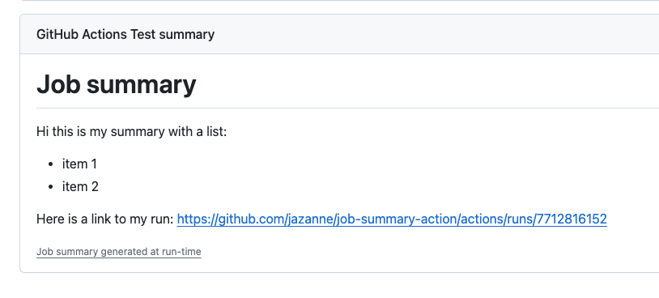

# Job summary action

Use this action to add a markdown summary to your job



## Example usage

```yaml
steps:
  name: Add job summary
  uses: jazanne/job-summary-action@v1
  with:
    # Use valid multiline markdown with expressions
    summary: |
      # Job summary

      Hi this is my summary with a list:
        - item 1
        - item 2

      Here is a link to my run: ${{ github.server_url }}/${{ github.repository }}/actions/runs/${{ github.run_id }}
```
